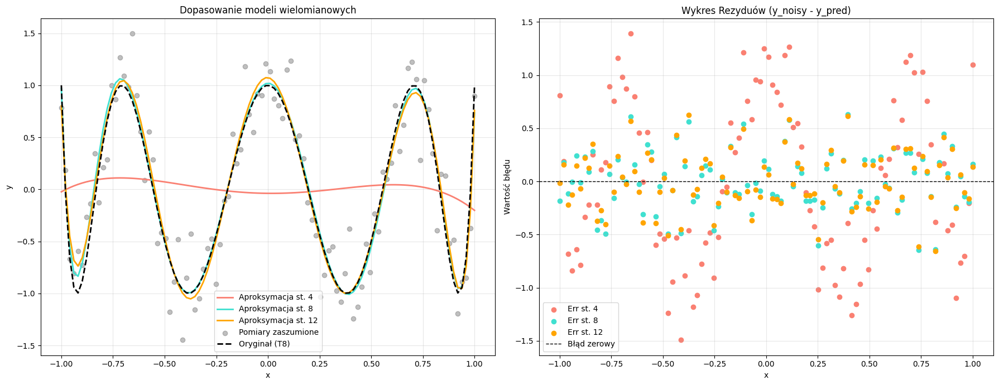
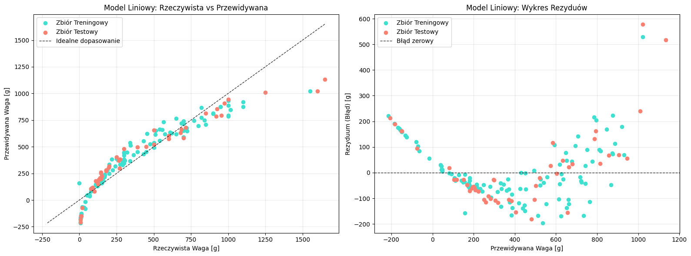
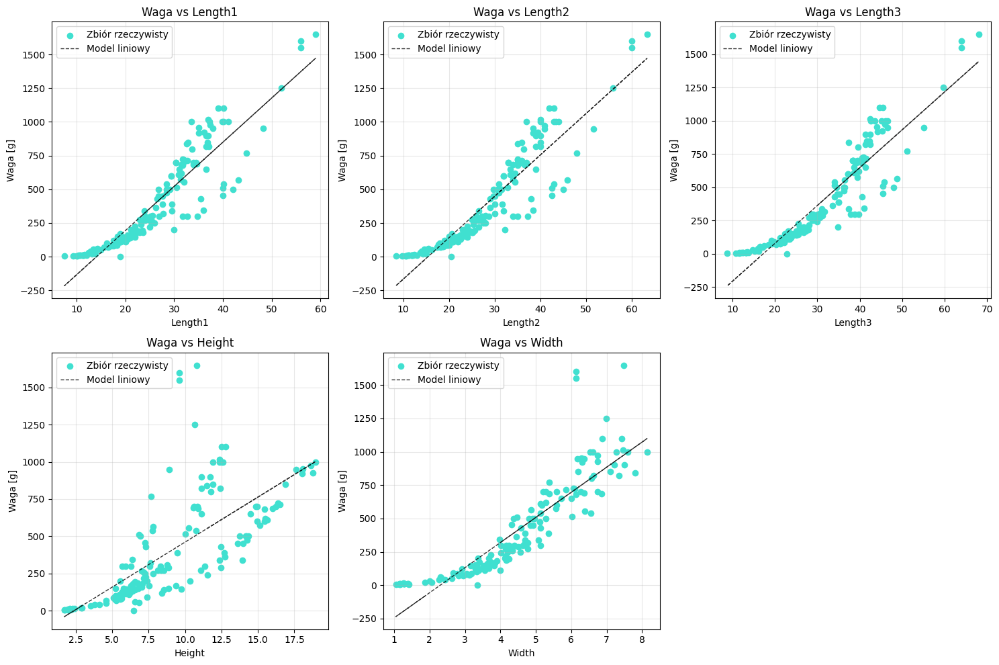
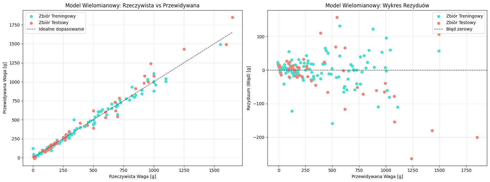

# Raport: Metoda Najmniejszych Kwadratów i Regresja

**Autor:** (Dzmitry, Nikitsin, Gr6)
[Link do repo z całym opracowaniem](https://github.com/dmitrykitty/least-squares-approximation)

## 1. Wprowadzenie Teoretyczne (Zadanie 1)

Celem metody najmniejszych kwadratów jest znalezienie takiego wektora parametrów $\mathbf{x}$, który minimalizuje błąd dopasowania modelu do danych. Błąd ten definiujemy jako **sumę kwadratów różnic** między wartościami rzeczywistymi $\mathbf{b}$ a przewidywanymi $A\mathbf{x}$.

Funkcja kosztu (błędu):
$$L(\mathbf{x}) = ||\mathbf{b} - A\mathbf{x}||^2 = (\mathbf{b} - A\mathbf{x})^T (\mathbf{b} - A\mathbf{x})$$

Minimalizacja tej funkcji prowadzi do rozwiązania układu równań normalnych:
$$A^T A \mathbf{x} = A^T \mathbf{b}$$

Ostateczny wzór na wektor parametrów $\mathbf{x}$ przy użyciu macierzy pseudoodwrotnej Moore’a-Penrose’a ($A^+$):
$$\mathbf{x} = (A^T A)^{-1} A^T \mathbf{b}$$

Kod implementujący to rozwiązanie znajduje się w załączonym skrypcie (funkcja `solve_LSQ_with_MoorePenrose_matrix`).

---

## 2. Rozwiązanie OLS za pomocą rozkładu QR (Zadanie 2)

W tym zadaniu wykorzystano rozkład QR macierzy $A$ w celu poprawy stabilności numerycznej obliczeń.

**Wyprowadzenie wzoru:**

Z definicji macierzy pseudoodwrotnej:
$$A^+ = (A^T A)^{-1} A^T$$

Stosujemy rozkład $A = QR$, gdzie:
* $Q$ jest macierzą ortonormalną ($Q^T Q = I$).
* $R$ jest macierzą górnotrójkątną kwadratową (odwracalną).

Podstawiamy $A = QR$ do wzoru na $A^+$:

$$A^+ = ((QR)^T (QR))^{-1} (QR)^T = (R^T Q^T Q R)^{-1} R^T Q^T = (R^T I R)^{-1} R^T Q^T =$$
$$ = (R^T R)^{-1} R^T Q^T = R^{-1} (R^T)^{-1} R^T Q^T = R^{-1} I Q^T $$

**Ostateczny wzór:**
$$A^+ = R^{-1} Q^T$$

Zatem rozwiązanie $x = A^+b$ przyjmuje postać:
$$x = R^{-1} Q^T b$$

Implementacja znajduje się w funkcji `solve_LSQ_with_QR`.

---

## 3. Aproksymacja Wielomianowa (Zadanie 4)

Przeprowadzono eksperyment polegający na aproksymacji zaszumionej funkcji (Wielomian Czebyszewa 8. stopnia) za pomocą wielomianów stopnia 4, 8 i 12.

**Wyniki eksperymentu:**



| Stopień Wielomianu   | SSE     | MSE    | RMSE   | MAE    |
|:---------------------|:--------|:-------|:-------|:-------|
| **4** (Underfitting) | 57.1466 | 0.5715 | 0.7560 | 0.6628 |
| **8** (Optymalny)    | 7.4177  | 0.0742 | 0.2724 | 0.2187 |
| **12** (Overfitting) | 7.1671  | 0.0717 | 0.2677 | 0.2189 |

**Wnioski:**

1.  **Niedopasowanie (Stopień 4):** Model jest zbyt prosty, co widać po wysokich błędach i nielosowym rozkładzie rezyduów (czerwone punkty na wykresie błędów tworzą wzór).
2.  **Optimum (Stopień 8):** Błąd drastycznie spada (MSE z 0.57 na 0.07). Rezydua (błękitne punkty) są losowo rozrzucone wokół zera, co świadczy o poprawnym modelu.
3.  **Przeuczenie (Stopień 12):** Dalsze zwiększanie stopnia nie przynosi istotnej poprawy wyników, a zwiększa ryzyko dopasowania do szumu.

---

## 4. Regresja Liniowa dla danych Fish Market (Zadanie 5)

Celem było przewidzenie wagi ryby (`Weight`) na podstawie jej wymiarów (`Length1`, `Length2`, `Length3`, `Height`, `Width`) przy użyciu modelu liniowego.

**Wyniki:**



**Metryki:**
* **RMSE (Train):** 111.46 g
* **RMSE (Test):** 151.35 g

**Wnioski:**
Model liniowy wykazuje **duże niedopasowanie (underfitting)**.
* Wykres "Rzeczywistość vs Predykcja" pokazuje, że dla małych ryb model przewiduje wagi ujemne (niemożliwe fizycznie), a dla dużych ryb systematycznie zaniża wagę.
* Wykres rezyduów układa się w kształt paraboli ("U-shape"), co sugeruje, że relacja między wymiarami a wagą nie jest liniowa.

---

## 5. Analiza Cech (Zadanie 6 - część 1)

Analiza wizualna zależności między wagą a poszczególnymi wymiarami potwierdziła nieliniowy charakter danych.



Waga ryby (objętość) zależy od sześcianu lub iloczynu jej wymiarów, a nie od ich prostej sumy. 
Dlatego zaproponowano użycie **Regresji Wielomianowej stopnia 2**, 
która uwzględnia interakcje (np. $L_n \times W$) oraz kwadraty cech.

---

## 6. Regresja Wielomianowa (Zadanie 6 - część 2)

Zastosowano transformację `PolynomialFeatures(degree=2)` i ponownie wytrenowano model.

**Wyniki:**



**Wnioski:**
* Model wielomianowy znacznie lepiej odwzorowuje dane.
* Wykres rezyduów stracił paraboliczny kształt i stał się bardziej losowy (szum biały).

---

## 7. Podsumowanie i Porównanie Modeli (Zadanie 7)

Poniżej zestawiono wyniki obu modeli (Liniowego i Wielomianowego) na zbiorze testowym.

**Tabela Porównawcza (Zbiór Testowy):**

| Metryka  | Model Liniowy | Model Wielomianowy (st. 2) |
|:---------|:--------------|:---------------------------|
| **SSE**  | 1 099 574.45  | 274 999.67                 |
| **MSE**  | 22 907.80     | 5 729.16                   |
| **RMSE** | 151.35 g      | 75.69 g                    |
| **MAE**  | 106.24 g      | 48.55 g                    | 

**Wnioski Końcowe:**

1.  **Skuteczność:** Model wielomianowy okazał się zdecydowanie lepszy. Zredukował średni błąd (MAE) z ~106g do ~48g. Jest to dowód na to, że waga ryby zależy nieliniowo od jej wymiarów.
2.  **Diagnostyka:**
    * Model Liniowy cierpiał na **niedouczenie** (wysoki błąd zarówno na zbiorze treningowym, jak i testowym).
    * Model Wielomianowy wykazuje cechy **lekkiego przeuczenia** (błąd na zbiorze testowym RMSE=75 jest wyższy niż na treningowym RMSE=41). Wynika to z dużej liczby cech (21) przy stosunkowo małym zbiorze danych. Mimo to, jego zdolność predykcji na nowych danych jest znacznie wyższa niż modelu liniowego.

---

## Dodatek: Kod Źródłowy

```python
import numpy as np
import matplotlib.pyplot as plt
import pandas as pd
from sklearn.model_selection import train_test_split
from sklearn.preprocessing import PolynomialFeatures
from numpy.polynomial import Chebyshev

# Funkcje pomocnicze (Zadanie 1 i 2)
def pinvMP(A):
    A_T = A.T
    ATA = A_T @ A
    try:
        ATA_inv = np.linalg.inv(ATA)
    except np.linalg.LinAlgError:
        raise ValueError("Macierz A^T A jest nieodwracalna")
    A_pinv = ATA_inv @ A_T
    return A_pinv

def solve_LSQ_with_MoorePenrose_matrix(A, b):
    A_pseudo_inv = pinvMP(A)
    x = A_pseudo_inv @ b
    return x

def solve_LSQ_with_QR(A, b):
    Q, R = np.linalg.qr(A, mode='reduced')
    R_inv = np.linalg.inv(R)
    A_pinv = R_inv @ Q.T
    x = A_pinv @ b
    return x

# Generowanie danych (Zadanie 4)
def generate_chebyshev_data(n_samples=100, noise_std=0.3):
    cheb_poly = Chebyshev([0] * 8 + [1])
    p_true = cheb_poly.convert(kind=np.polynomial.Polynomial)
    x = np.linspace(-1, 1, n_samples)
    y_ideal = p_true(x)
    np.random.seed(13)
    noise = np.random.normal(0, noise_std, size=len(x))
    y_noisy = y_ideal + noise
    return x, y_ideal, y_noisy

def create_vandermonde_matrix(x, degree):
    return np.vander(x, degree + 1, increasing=True)

def calculate_metrics(y_true, y_pred):
    residuals = y_true - y_pred
    sse = np.sum(residuals ** 2)
    mse = np.mean(residuals ** 2)
    rmse = np.sqrt(mse)
    mae = np.mean(np.abs(residuals))
    return {"SSE": sse, "MSE": mse, "RMSE": rmse, "MAE": mae}

# Eksperyment wielomianowy (Zadanie 4)
x_samples, y_true, y_data = generate_chebyshev_data(n_samples=100, noise_std=0.3)
# ... (kod rysujący wykresy i liczący metryki dla st. 4, 8, 12) ...

# Regresja dla Fish Market (Zadanie 5 i 6)
df = pd.read_csv("data/Fish.csv")
X = df[df.columns[2:]]
Y = df[df.columns[1]]

# Model Liniowy
X_train, X_test, Y_train, Y_test = train_test_split(X, Y, test_size=0.3, random_state=13)
A_train = np.c_[np.ones(len(X_train)), X_train]
A_test = np.c_[np.ones(len(X_test)), X_test]
w_lin = solve_LSQ_with_MoorePenrose_matrix(A_train, Y_train)
# ... (predykcja i metryki) ...

# Model Wielomianowy (Zadanie 6)
poly = PolynomialFeatures(degree=2, include_bias=True)
X_train_poly = poly.fit_transform(X_train)
X_test_poly = poly.transform(X_test)
w_poly = solve_LSQ_with_MoorePenrose_matrix(X_train_poly, Y_train)
# ... (predykcja i metryki) ...